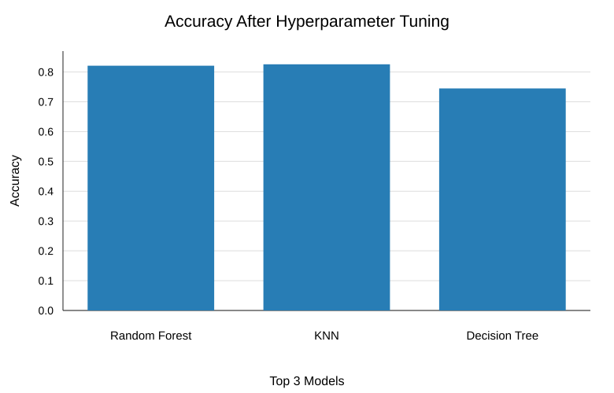
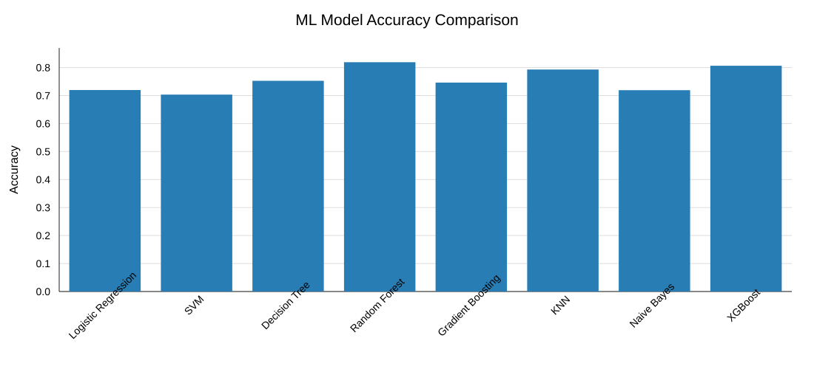
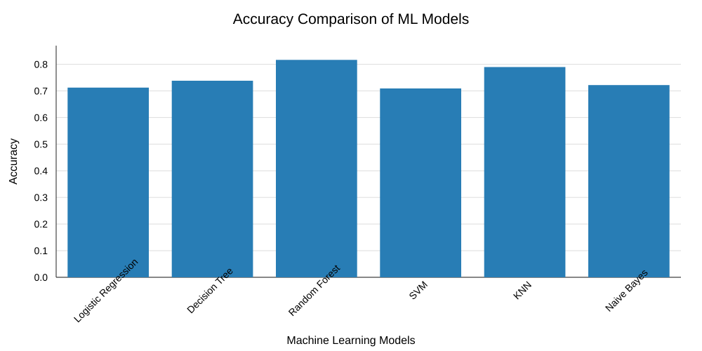
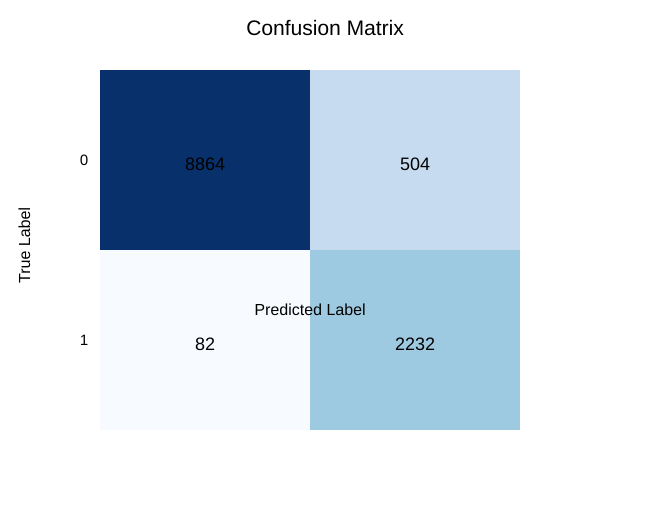
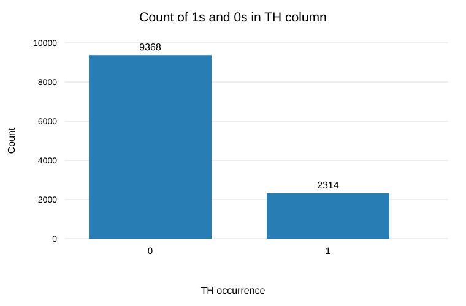

# 🌩️ Thunderstorm (TH) Forecasting System

An end-to-end machine learning project that predicts thunderstorm occurrence from atmospheric inputs. A Streamlit interface sends user inputs to a FastAPI service, which loads a saved scikit-learn model and returns a binary prediction and, when available, its probability.

## 📌 Project Overview

Thunderstorm forecasting in this project means classifying a set of atmospheric measurements as either no thunderstorm (`0`) or thunderstorm (`1`). Stability, moisture, and convective indicators can provide useful signals about conditions associated with thunderstorm development. The project combines a Streamlit frontend, a FastAPI prediction backend, and MLflow experiment tracking used during model development.

```text
User → Streamlit web app → FastAPI backend → saved model → prediction and probability
```

## 🎯 Objectives

- Build a machine learning model for thunderstorm occurrence prediction.
- Address class imbalance during model development.
- Compare and evaluate classification models.
- Track model parameters, metrics, and artifacts with MLflow.
- Serve predictions through FastAPI.
- Provide an interactive Streamlit interface.
- Demonstrate an end-to-end model development and inference workflow.

## 📊 Dataset

The repository contains source and processed CSV files under `data/raw/` and `data/processed/`. The processed file, `data/processed/merged_df_all12k_combined.csv`, contains joined atmospheric-index and surface-observation records. Its target column is `TH`, representing thunderstorm occurrence as a binary value. The model consumes the eight features below; `Date` and `TH` are not model inputs.

| Feature | Description supported by the repository |
|---|---|
| `SWEAT index` | SWEAT atmospheric index, present in the source data. |
| `K index` | K atmospheric index, present in the source data. |
| `Totals totals index` | Totals Totals atmospheric index, present in the source data. |
| `Environmental_Stability` | Derived in the notebook as `Showalter index + LIFTED index`. |
| `Moisture_Indices` | Derived from `PRECIPITABLE WATER`. |
| `Convective_Potential` | Derived as `CAPE + CINE`. |
| `Temperature_Pressure` | Derived from `1000-500 THICKNESS`. |
| `Moisture_Temperature_Profiles` | Derived from `PLCL`. |

The processed dataset also has a `Date` column, used to join observations, and the `TH` label. The notebook joins `index.csv` and `surface.csv` on the date. Dataset provenance, measurement units, and geographic coverage are not specified in the checked-in code and files.

## 🧠 Machine Learning Pipeline

The development workflow is recorded in `experiments/experiment.ipynb`; the running API performs inference using the saved artifact and does not train a model at startup.

1. Load the atmospheric-index and surface CSV data.
2. Join records on date and derive the five grouped features shown above.
3. Separate the eight model features from the `TH` target.
4. Apply SMOTE to the full feature and target dataset, then make an 80/20 train/test split with `random_state=42` in the notebook workflow.
5. Train and compare classifiers, including Logistic Regression, Decision Tree, Random Forest, SVM, KNN, and Naive Bayes; a later notebook comparison also includes Gradient Boosting and XGBoost.
6. Tune selected models with `GridSearchCV` using five-fold cross-validation and accuracy scoring.
7. Evaluate with accuracy, precision, recall, F1, and meteorological scores (POD, FAR, HSS, CSI). No ROC-AUC result is logged in the included experiment database.
8. Log tuned model parameters, metrics, and scikit-learn model artifacts to MLflow. The notebook saves its selected model as a Joblib pickle; the checked-in inference artifact is `models/KNN_best_model.pkl`.
9. At prediction time, FastAPI arranges the inputs in the model's expected feature order and returns the predicted class and positive-class probability.

SMOTE creates synthetic minority-class samples to reduce class imbalance during training. In the notebook, it is applied before the train/test split, so synthetic samples may influence both partitions; the reported experiment scores should be read in that context.

## 🤖 Model

The artifact used by the API is a scikit-learn `KNeighborsClassifier`, configured with 3 neighbors and distance-based weights. KNN assigns a class based on nearby examples in the feature space, with nearer neighbors receiving greater influence under the saved model's weighting. It is a classification model operating on the project's tabular atmospheric inputs. The API exposes the classifier's `predict` result and, where supported, `predict_proba` for class `1`.

### Logged evaluation results

The following values are from the tuned-model runs recorded in `experiments/mlflow.db`. They are experiment results from the notebook workflow, not a claim of independent operational forecast performance.

| Model | Accuracy | Precision | Recall | F1 |
|---|---:|---:|---:|---:|
| KNN | 0.8258 | 0.7547 | 0.9619 | 0.8458 |
| Random Forest | 0.8194 | 0.7670 | 0.9141 | 0.8341 |
| Decision Tree | 0.7452 | 0.6901 | 0.8840 | 0.7751 |

These are the logged values for the tuned runs in the local tracking database. The checked-in KNN artifact's parameters (`n_neighbors=3`, `weights=distance`) are consistent with the KNN model saved for inference.

### Notebook result charts

The following figures reproduce the accuracy comparisons and dataset summaries saved or shown in the experiment notebook. The initial model comparisons and tuned comparison are separate notebook runs, so their values may differ from the MLflow table above.

**Accuracy after hyperparameter tuning**



**Eight-model accuracy comparison**



**Six-model baseline accuracy comparison**



**Confusion matrix**



The notebook creates this matrix from predictions over the full processed feature dataset, rather than a separate held-out test set; treat it as an exploratory visualization, not a test-set score.

**Target class counts in the processed dataset**



## 🔬 MLflow Experiment Tracking

The experiment notebook sets the experiment name to `Thunderstorm_Prediction_ML` and logs tuned-model parameters, classification and meteorological metrics, and scikit-learn model artifacts. The associated tracking database is `experiments/mlflow.db`, with model artifact directories under `experiments/mlruns/`. The root-level `mlflow.db` is also present but currently contains no runs.

MLflow is used by the notebook workflow, not by the FastAPI prediction path. To open the checked-in experiment database locally, start the UI from the repository root with the experiment dependencies:

```bash
uv run --with-requirements local-requirements.txt mlflow ui --backend-store-uri sqlite:///experiments/mlflow.db --host 127.0.0.1 --port 5000
```

Open `http://127.0.0.1:5000`. The database records artifact locations from the machine where the experiments were logged; those absolute paths may need adjustment for artifact browsing on another machine.

## 🚀 Run the Application

The runtime dependencies are listed in `pyproject.toml` and `requirements.txt`. With `uv` installed, sync the project environment:

```bash
uv sync
```

Start the API from the project root:

```bash
uv run uvicorn api.main:app --host 127.0.0.1 --port 8000
```

In a second terminal, start the Streamlit interface:

```bash
uv run streamlit run streamlit_app/ui.py
```

The Streamlit frontend defaults to `http://127.0.0.1:8000`. To point it to another API base URL, set `API_URL` before starting Streamlit.

### API routes

| Method | Route | Purpose |
|---|---|---|
| `GET` | `/` | Returns a message indicating that the API is running. |
| `GET` | `/health` | Returns `{"status":"ok"}`. |
| `POST` | `/predict` | Accepts the eight numeric input fields and returns `prediction` and `probability`. |

Example prediction request:

```json
{
  "SWEAT_index": 91.2,
  "K_index": -1.4,
  "Totals_totals_index": 24.7,
  "Environmental_Stability": 25.8,
  "Moisture_Indices": 22.8,
  "Convective_Potential": 0.0,
  "Temperature_Pressure": 5636,
  "Moisture_Temperature_Profiles": 993.98
}
```

The API loads `models/KNN_best_model.pkl` relative to the project location. `requirements.txt` and `pyproject.toml` describe the runtime dependencies; `local-requirements.txt` additionally includes notebook, modeling, and MLflow development tools.

## 🗂️ Project Structure

```text
.
├── api/                 # FastAPI application
├── app/                 # Input schema, model loading, and prediction logic
├── data/
│   ├── raw/             # Source CSV files
│   └── processed/       # Joined/derived dataset
├── experiments/         # Notebook, MLflow database, and logged artifacts
├── models/              # Saved inference model
├── streamlit_app/       # Streamlit frontend that calls the API
├── app.py               # Separate direct-model Streamlit app
├── pyproject.toml       # Project metadata and runtime dependencies
├── requirements.txt     # Runtime dependencies
└── local-requirements.txt # Development and experiment dependencies
```
